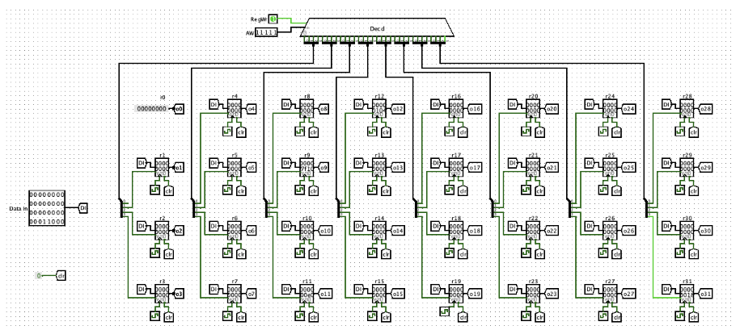
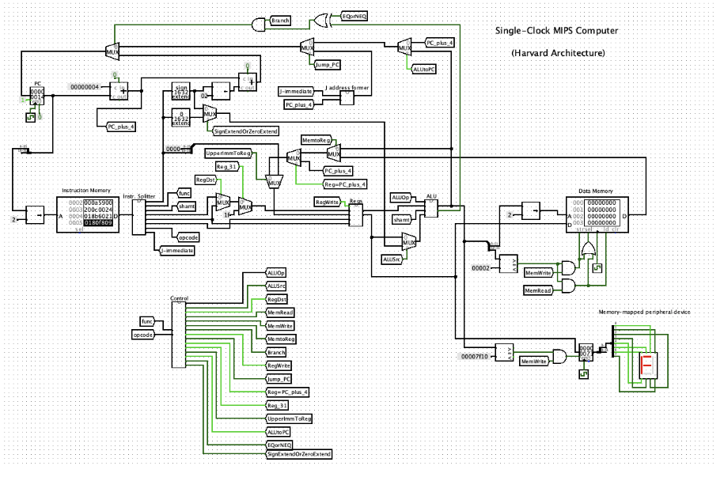

# ComputerSystems
 MIPS Architecture and Assembly Language with Circuit Design
 Covered: 
 - MIPS Processor Architecture & Organization
 - The function and implementation of the main functional units (PC, Register File, ALU, Program RAM, Data RAM)
 - Computer Performance
    - Methods and metrics for evaluating and describing the performance of computer systems are explained. The advantages and disadvantages of various metrics are considered.
 - MIPS Assembly Language
    - Writing and verifying MIPS programs using the MARS Simulator. Starting with simple programs and moving to more complex problems involving processing of text and numbers.
 -  Mini MIPS Processor
    - Development and verification of a cut-down MIPS processor implementation in the Logisim gate-level logic simulator. Design and execution of a machine language program on the processor.

### Assembly Programs

For each assignment, I designed various assembly programs. These programs were submitted in the form of .asm files.

### Circuit Designs

Along with assembly programs, some assignments required me to submit circuit designs. These were provided as .circ files.

Some include:
- Circuit to implement 
a new instruction


### Additional Information
- Program used for design: Logisim

## Circuit Design
<p align="center">
  
  
</p>

<!-- heading -->
## Assembly Code
<!-- code -->
```assembly
# Pure assembly language program for Linux running on MIPS

	.data
hello:	.ascii "Hello\n"     # char hello[6]="Hello\n"; 
in:	.space 1             # char in[1]
out:	.space 1             # char out[1]

	.text
	.globl __start        # Default entry point
__start:
	li $a0, 1             # Standard output (fd=1)
	la $a1, hello         # address of the string (hello[])
	li $a2, 6             # number of bytes to write (6)
	li $v0, 4004          # write() syscall
	syscall
	nop
	nop

        li $a0, 0             # Standard input (fd=0) 
        la $a1, in            # address on the input buffer (array in[])
        li $a2, 1             # size of the input buffer in bytes (1)
        li $v0, 4003          # read() syscall
        syscall
        nop
        nop

        la $t0,in
        lbu $t1,0($t0)        # load byte from in[0]
        
        la $t2,out        
        sb $t1,0($t2)         # store it into out[0]

        li $a0, 1             # Standard output (fd=1)
        la $a1, out           # address of the output buffer (array out[])
        li $a2, 1             # amount of bytes to print (1) 
        li $v0, 4004          # write() syscall
        syscall
        nop	
        nop

	li $a0,0              # exit code
	li $v0, 4001          # exit() syscall
        syscall
	# no return

```
